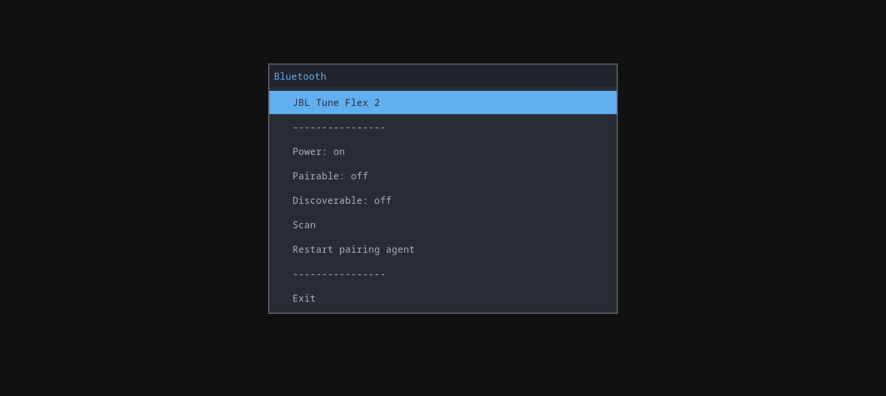

# 🔵 rofi-bt-manager
A Rofi-based Bluetooth manager for Linux

Manage Bluetooth devices and controller settings directly from a Rofi menu.
> A modern alternative to [rofi-bluetooth](https://github.com/nickclyde/rofi-bluetooth).
<p align="center">
    <br/>
</p>
<p align="center">
    <br/>
</p>

## ✨ Features
### Bluetooth controller
- Turn Bluetooth on/off
- Scan for nearby Bluetooth devices
- Toggle pairable mode
- Toggle discoverable mode
- Restart the Bluetooth pairing agent

### Bluetooth devices
- Connect / disconnect devices
- Pair / unpair devices
- Trust / untrust devices
- Remove devices
- Display device MAC addresses

## ⚙️ Requirements
- [BlueZ](https://github.com/bluez/bluez) (`bluetoothctl`)
- [Rofi](https://github.com/davatorium/rofi)

## 📦 Installation
```bash
git clone https://github.com/z4pdy/rofi-bt-manager
cd rofi-bt-manager
chmod +x rofi-bt-manager
```
## 🚀 Usage
Run the script to open the Bluetooth manager:

```bash
./rofi-bt-manager
```
Additional arguments passed to the script are forwarded to Rofi.

### Waybar integration example
Add `rofi-bt-manager` to your `PATH`, then add the following module to your Waybar config:

```json
"bluetooth": {
    "format-disabled": "󰂭",
    "format-off": "󰂲",
    "format-on": "",
    "format-connected": "󰂱",
    "format-no-controller": "󰂭",
    "tooltip-format-connected": "{device_alias}\n{device_address}",
    "on-click": "rofi-bt-manager -i"
}
```
